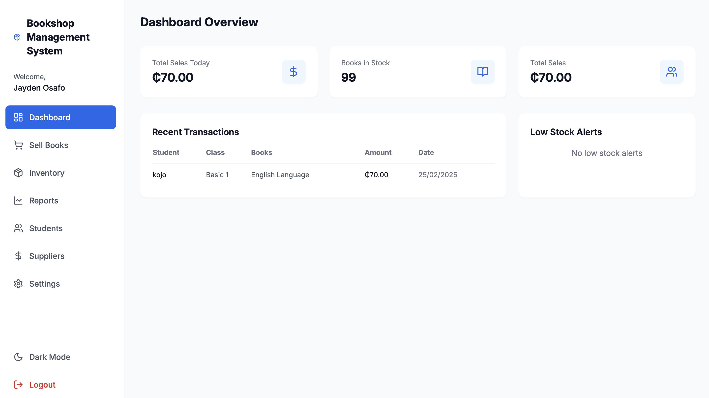
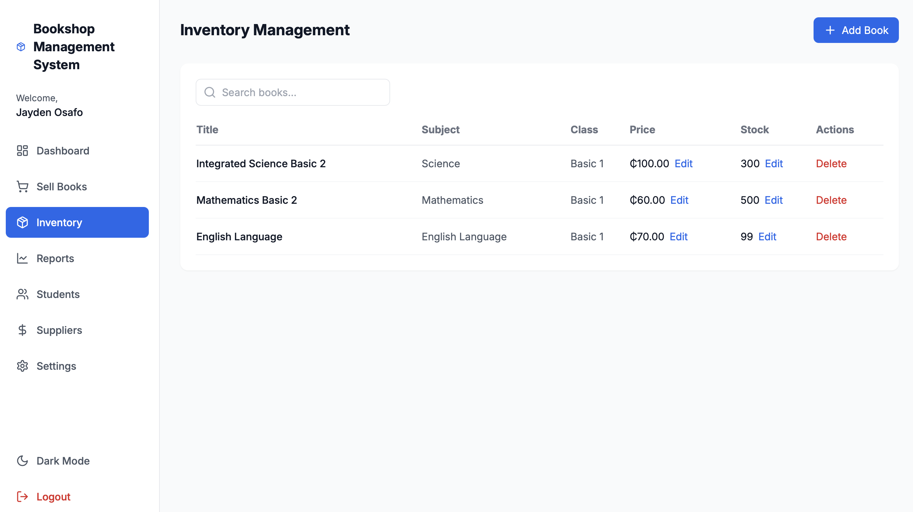

# Bookshop Management System

A modern, full-stack web application for managing school bookshop operations. Built with React, TypeScript, and Node.js, this system helps school bookshops manage their inventory, track sales, and maintain student records efficiently.



## Features

### 📊 Dashboard
- Real-time overview of daily sales
- Books in stock counter
- Total sales tracking
- Recent transactions list
- Low stock alerts

### 📚 Inventory Management


- Add, edit, and delete books
- Track stock levels
- Set low stock thresholds
- Search and filter books
- Price management
- Multiple subjects and class levels support

### 💰 Sales Management
- Easy book selection interface
- Student information recording
- Real-time price calculation
- Stock level verification
- Digital receipts generation

### 📝 Reports
- Sales reports with date range filtering
- Student purchase history
- Stock level reports
- Export functionality to CSV

### 👥 User Authentication


- Secure user authentication
- User role management
- Password recovery
- Remember me functionality

### ⚙️ Settings
- Store name customization
- Currency selection (GHS, USD, EUR)
- Low stock threshold configuration
- Dark mode support

## Technology Stack

- **Frontend:**
  - React
  - TypeScript
  - TailwindCSS
  - Lucide Icons
  - Context API for state management

- **Backend:**
  - Node.js
  - Express
  - MongoDB
  - JWT Authentication

## Getting Started

### Prerequisites
- Node.js (v14 or higher)
- MongoDB
- npm or yarn

### Installation

1. Clone the repository
```bash
git clone https://github.com/yourusername/bookshop-management.git
cd bookshop-management
```

2. Install dependencies
```bash
# Install backend dependencies
cd server
npm install

# Install frontend dependencies
cd ../client
npm install
```

3. Set up environment variables
```bash
# In the server directory, create a .env file
PORT=3000
MONGODB_URI=your_mongodb_uri
JWT_SECRET=your_jwt_secret

# In the client directory, create a .env file
REACT_APP_API_URL=http://localhost:3000/api
```

4. Start the application
```bash
# Start the backend server
cd server
npm run dev

# In a new terminal, start the frontend
cd client
npm start
```

## Usage

1. Create an account or log in to existing account
2. Navigate through the sidebar to access different features
3. Add books to inventory
4. Process sales transactions
5. Generate reports
6. Configure settings as needed

## Contributing

1. Fork the repository
2. Create your feature branch (`git checkout -b feature/AmazingFeature`)
3. Commit your changes (`git commit -m 'Add some AmazingFeature'`)
4. Push to the branch (`git push origin feature/AmazingFeature`)
5. Open a Pull Request

## License

This project is licensed under the MIT License - see the [LICENSE](LICENSE) file for details.

## Acknowledgments

- [React](https://reactjs.org/)
- [TailwindCSS](https://tailwindcss.com/)
- [Lucide Icons](https://lucide.dev/)
- [MongoDB](https://www.mongodb.com/) 